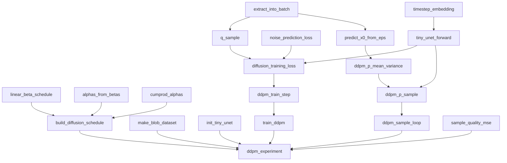

# DDPM from Scratch

A pure PyTorch implementation of **Denoising Diffusion Probabilistic Models**
([Ho, Jain & Abbeel, 2020](https://arxiv.org/abs/2006.11239)), built step by step
with no diffusion libraries — only `torch` and `torch.nn.functional`.

## What's implemented

- **Forward diffusion schedule** — linear β schedule, α/ᾱ derivations, and the
  closed-form forward process `q(x_t | x_0)` that jumps straight to any noise
  level without simulating each intermediate step.
- **Simplified training objective** — the noise-prediction loss `L_simple`
  (MSE between the true noise and the model's predicted noise).
- **Tiny time-conditioned denoiser** — sinusoidal timestep embeddings (à la
  Transformer positional encodings) feeding a compact residual CNN that
  predicts noise `ε` from a noisy image and its timestep.
- **Ancestral DDPM sampler** — the reverse process: `x0` prediction from `ε`,
  the reverse-process posterior mean/variance, and the full sampling loop
  from pure noise down to `t = 0`.
- **Synthetic experiment** — a toy dataset of bright disks ("blobs") on a
  black background, trained end-to-end, then evaluated by comparing
  generated samples against a pure-noise baseline.

## Why this approach works

Diffusion models learn to reverse a gradual noising process. Rather than
simulating that forward process step by step, DDPM derives a closed-form
shortcut: `x_t = sqrt(ᾱ_t) · x0 + sqrt(1 − ᾱ_t) · ε`, letting you sample any
noise level in one shot. Instead of training a network to predict the clean
image directly, DDPM trains it to predict the *noise* `ε` that was added —
this reparameterization is simpler to optimize and is what makes the
"simplified" loss (`L_simple`) just a plain MSE. Sampling then walks that
process backward: starting from pure Gaussian noise, the model's noise
prediction is used to estimate the current best guess of the clean image,
which in turn defines a Gaussian to sample the next, slightly cleaner image
from — repeated for every timestep down to zero.

## How it fits together

The diagram traces the call graph inside `model.py`: which functions build the
noise schedule, which ones form the training step, and which ones chain
together into the reverse sampler. Everything funnels into `ddpm_experiment`,
the single entry point `scaffold.py` calls.



- **Schedule** (`linear_beta_schedule`, `alphas_from_betas`, `cumprod_alphas`)
  feeds `build_diffusion_schedule`, which precomputes every β/α/ᾱ value used
  everywhere else.
- **Training path** — `q_sample` uses the schedule to jump straight to a
  noisy image; `tiny_unet_forward` predicts the noise that was added;
  `diffusion_training_loss` scores that prediction; `ddpm_train_step` and
  `train_ddpm` turn that into a minibatch SGD loop.
- **Sampling path** — the same `tiny_unet_forward` feeds `ddpm_p_sample`,
  which uses `predict_x0_from_eps` and `ddpm_p_mean_variance` to take one
  reverse (denoising) step; `ddpm_sample_loop` repeats that from pure noise
  down to a generated image.
- **`ddpm_experiment`** ties it all together: build data + schedule + model,
  train, sample, then score against a pure-noise baseline with
  `sample_quality_mse`.

## Project layout

Everything lives in two files, matching the original step-by-step solutions:

```
model.py      # all 20 building blocks: schedule, loss, tiny CNN, dataset,
              # training loop, sampler, evaluation metric, full experiment
scaffold.py   # imports model.py and runs the end-to-end experiment
```

## Running it

```bash
pip install -r requirements.txt
python scaffold.py
```

Example output:

```
steps: 60
loss: 1.0579 -> 0.9385
noise baseline MSE:  0.9739
trained sample MSE:  0.6240
improvement (noise - sample): 0.3499
```

A positive `improvement` means the trained model's generated samples land
closer (in nearest-neighbor MSE) to the real blob dataset than raw Gaussian
noise does — evidence the reverse process has actually learned the data
manifold, even from this deliberately tiny model and short training run.

## Notes

This is intentionally minimal: 8×8 grayscale images, a single-block residual
CNN (no multi-scale U-Net, no attention), and tens — not thousands — of
training steps. It's meant to make every piece of the DDPM math legible in
code, not to produce high-fidelity samples. Scaling up `hidden`, `num_steps`,
and `T` in `ddpm_experiment` improves results at the cost of runtime.
