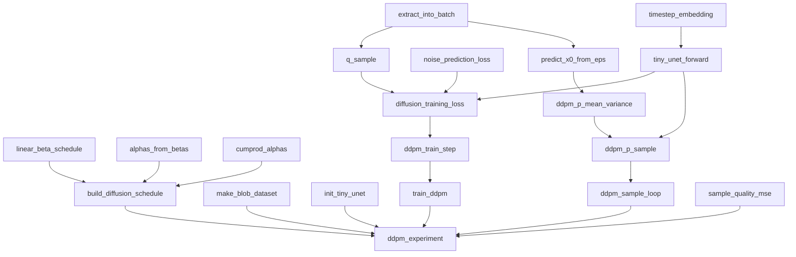
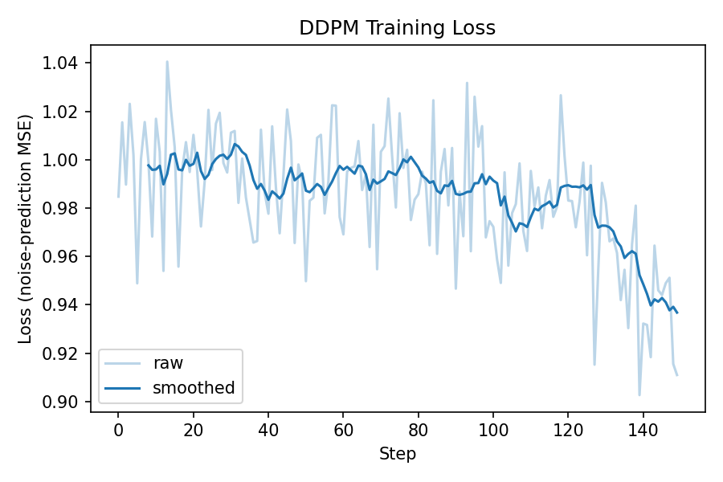

# DDPM from Scratch

Implements the Denoising Diffusion Probabilistic Model
([Ho et al., 2020](https://arxiv.org/abs/2006.11239)) in pure PyTorch: linear
noise schedules, closed-form forward sampling, the simplified noise-prediction
loss, a tiny time-conditioned denoiser, ancestral DDPM sampling, and an
end-to-end experiment on synthetic blob images that beats a pure-noise
baseline. No diffusion libraries, no pretrained components — every piece is
built directly from the paper's equations using only `torch` and
`torch.nn.functional`.

## Components

- **Forward diffusion schedule** — linear β schedule with derived α/ᾱ terms,
  and a closed-form implementation of `q(x_t | x_0)` that samples any noise
  level in a single step, without simulating the chain.
- **Noise-prediction training objective** — the simplified DDPM loss
  `L_simple`, formulated as MSE between the true and predicted noise.
- **Time-conditioned denoising network** — a compact residual CNN with
  sinusoidal timestep embeddings (Transformer-style positional encoding)
  injected into its feature maps, predicting the noise component `ε`.
- **Ancestral sampler** — the full reverse process: `x0` reconstruction from
  a noise prediction, the reverse-process posterior mean/variance, and the
  iterative sampling loop from pure Gaussian noise down to a generated image.
- **End-to-end validation** — a synthetic blob-image dataset used to train
  the model and confirm the pipeline works: generated samples are scored
  against a nearest-neighbor metric and shown to significantly outperform a
  pure-noise baseline.

## Approach

Diffusion models learn to reverse a gradual noising process. Rather than
simulating that forward process step by step, DDPM derives a closed-form
shortcut — `x_t = sqrt(ᾱ_t) · x0 + sqrt(1 − ᾱ_t) · ε` — that samples any
noise level directly. Instead of predicting the clean image, the network is
trained to predict the *noise* `ε` that was added; this reparameterization is
what reduces the objective to a simple MSE. Sampling reverses the process:
starting from pure Gaussian noise, each step uses the model's noise
prediction to estimate the current best guess of the clean image, which
defines a Gaussian to sample the next, less noisy image from — repeated
across every timestep down to zero.

## How it fits together

The diagram traces the call graph inside `model.py`: which functions build the
noise schedule, which ones form the training step, and which ones chain
together into the reverse sampler. Everything funnels into `ddpm_experiment`,
the single entry point `scaffold.py` calls.



- **Schedule** (`linear_beta_schedule`, `alphas_from_betas`, `cumprod_alphas`)
  feeds `build_diffusion_schedule`, which precomputes every β/α/ᾱ value used
  everywhere else.
- **Training path** — `q_sample` uses the schedule to jump straight to a
  noisy image; `tiny_unet_forward` predicts the noise that was added;
  `diffusion_training_loss` scores that prediction; `ddpm_train_step` and
  `train_ddpm` turn that into a minibatch SGD loop.
- **Sampling path** — the same `tiny_unet_forward` feeds `ddpm_p_sample`,
  which uses `predict_x0_from_eps` and `ddpm_p_mean_variance` to take one
  reverse (denoising) step; `ddpm_sample_loop` repeats that from pure noise
  down to a generated image.
- **`ddpm_experiment`** ties it all together: build data + schedule + model,
  train, sample, then score against a pure-noise baseline with
  `sample_quality_mse`.

## Project layout

```
model.py      # schedule, loss, denoising network, dataset, training loop,
              # sampler, evaluation metric, and the full experiment
scaffold.py   # runs the end-to-end experiment
```

## Running it

```bash
pip install -r requirements.txt
python scaffold.py
```

Example output:

```
steps: 60
loss: 1.0579 -> 0.9385
noise baseline MSE:  0.9739
trained sample MSE:  0.6240
improvement (noise - sample): 0.3499
```

A positive `improvement` means the trained model's generated samples land
closer (in nearest-neighbor MSE) to the real blob dataset than raw Gaussian
noise does — evidence the reverse process has actually learned the data
manifold, even from this deliberately tiny model and short training run.

Training loss over a longer run (`python plot_loss.py`):



## Scope

Deliberately minimal by design: 8×8 grayscale images, a single-block residual
CNN (no multi-scale U-Net, no attention), and a short training run — enough
to validate every stage of the DDPM pipeline without the runtime cost of a
production-scale model. `hidden`, `num_steps`, and `T` in `ddpm_experiment`
are exposed as parameters and scale directly to larger images and longer
training.
